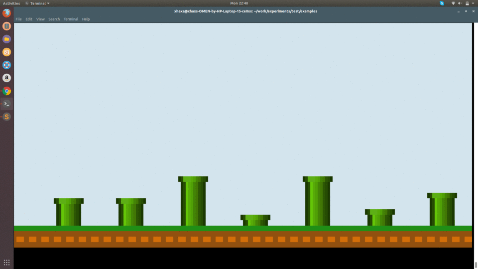

# gui-term
gui-term is a simple library or gem for creating gui for terminal in ruby

# Prerequisites

1. `ruby`
2. `gnome-terminal`

# Example

<br/>
Find the code for this animation at `examples/flappyAnime.rb`

## Running the example
 To run the sample go to `examples` directory and run the following command from terminal
 ```bash
 	$ ruby expInit.rb
 ```

# Usage

Easy to use

1. Just import it 
2. add your animations inside the `Guit.run` block
3. use the `Guit.addToDraw` to add your object
4. run your program in terminal

e.g.
```ruby
require '../guit/guit'

Guit.run{
	Guit.clearScreen
	Guit.addToDraw(Guit.drawStroke(1, 1, 10, 10, color: Guit.rgbBack(128, 120, 123)))
}
```

# Features

1. `True Color` support i.e. rgb 0-255
2. Uses the Bresenham's algorithm for drawing the lines and circles
3. Supports arc drawing

# Why not to use?

1. Not tested

*Note*: You are encouraged to add tests for this repository

# Contribute

Open for all to contribute:)
